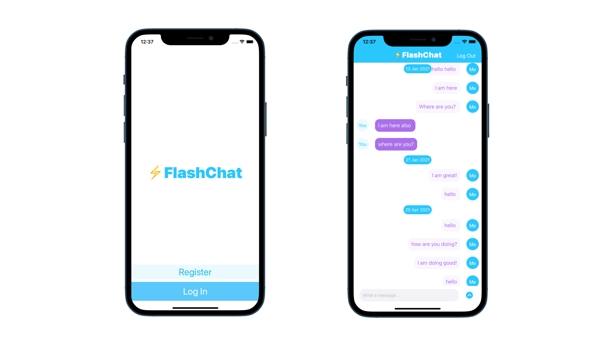

# Flash-Chat

## Our Goal

Flash Chat is an internet based messaging app similar to WhatsApp, I am using a service called Firebase Firestore as a backend database to store and retrieve our messages from the cloud. 

## What I learned

* How to integrate third party libraries in your app using Cocoapods and Swift Package Manager.
* How to store data in the cloud using Firebase Firestore.
* How to query and sort the Firebase database.
* How to use Firebase for user authentication, registration and login.
* How to work with UITableViews and how to set their data sources and delegates.
* How to create custom views using .xib files to modify native design components.
* How to embed View Controllers in a Navigation Controller and understand the navigation stack.
* How to create a constants file and use static properties to store Strings and other constants.
* Learn about Swift loops and create animations using loops.
* Learn about the App Lifecycle and how to use viewWillAppear or viewWillDisappear.
* How to create direct Segues for navigation.

